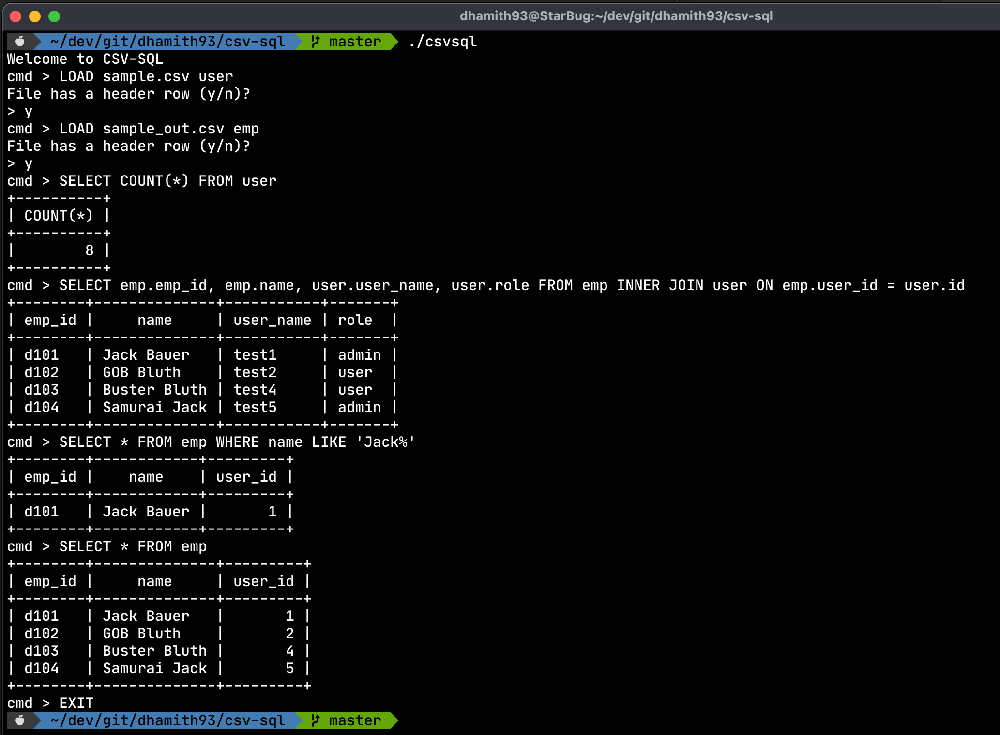

# csv-sql
Command-line tool to load csv and xlsx files and run sql commands 

[](https://github.com/dhamith93/csv-sql/actions/workflows/go.yml)

## Usage

csv-sql supports loading and saving results as CSV and XLSX files with data processing with SQLite compatible sql commands.

### Loading a file
```
LOAD /path/to/file table_name
```
You can set up headers if the first row is not a header.
For XLSX files, when loading, this will ask to select the sheet of the file to load.

### Creating a new table with a select query
```sql
CREATE TABLE emp_user AS SELECT emp.emp_id, emp.name, user.user_name, user.role FROM emp INNER JOIN user ON emp.user_id = user.id
```

### Saving a table as a csv

This only supports CSV for now

```
SAVE table_name /path/to/save.csv
```
## Screenshots


